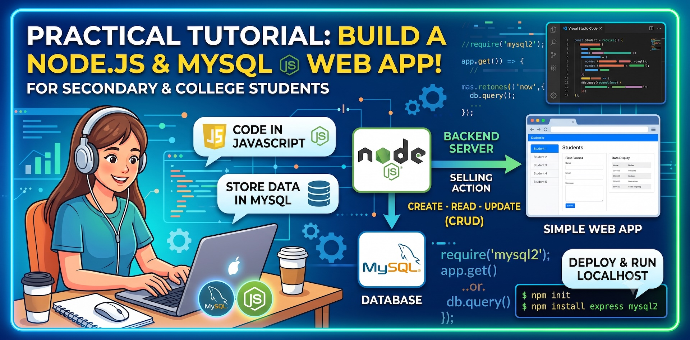

# Building a Simple Database Web Application

This page gives you a step-by-step guide to starting a simple MySQL database web application using Node.js and Express. By the end of this guide, you will have a basic web application that can perform CRUD (Create, Read, Update, Delete) operations on a MySQL database.
